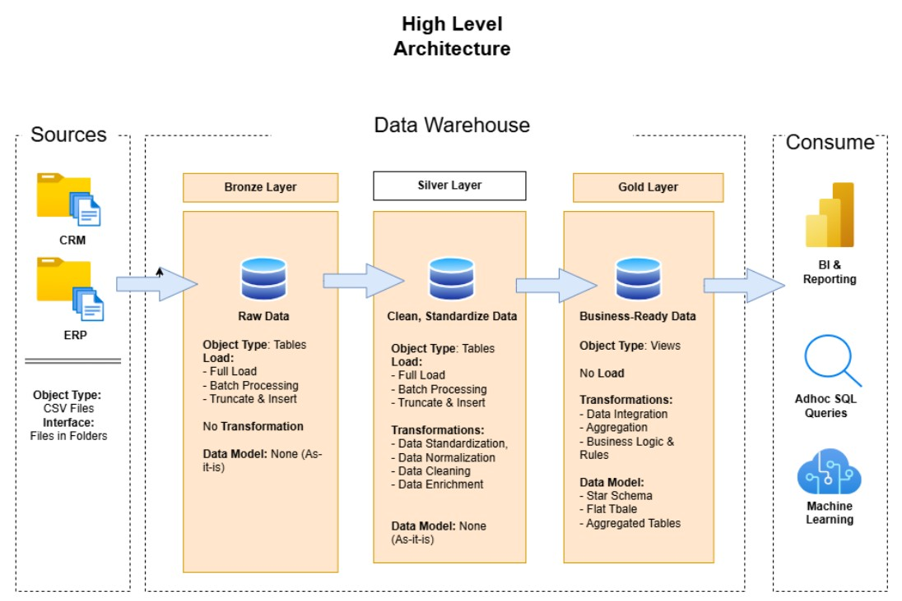

# 𝗠𝗼𝗱𝗲𝗿𝗻 𝗗𝗮𝘁𝗮 𝗪𝗮𝗿𝗲𝗵𝗼𝘂𝘀𝗲 𝗦𝗼𝗹𝘂𝘁𝗶𝗼𝗻 (𝗠𝗲𝗱𝗮𝗹𝗹𝗶𝗼𝗻 𝗔𝗿𝗰𝗵𝗶𝘁𝗲𝗰𝘁𝘂𝗿𝗲)

Welcome to the Data Warehouse & Analytics Project! 🚀

This repo features a complete data warehouse solution built to deliver real, actionable insights following modern data engineering best practices.

## Data Architecture



The data architecture for this project follows Medallion Architecture Bronze, Silver, and Gold layers:

1. **Bronze Layer:** Stores raw, unprocessed data exactly as received from source systems. Data is ingested from CSV files into the SQL Server database.
2. **Silver Layer:** Applies data cleansing, standardization, and normalization to prepare data for analysis.
3. **Gold Layer:** Contains business-ready data modeled in a star schema, optimized for reporting and analytics.

## Project Overview

This project involves:

1. **Data Architecture**: Designing a Modern Data Warehouse Using Medallion Architecture **Bronze**, **Silver**, and **Gold** layers.
2. **ETL Pipelines**: Extracting, transforming, and loading data from source systems into the warehouse.
3. **Data Modeling**: Developing fact and dimension tables optimized for analytical queries.


## 🚀 Project Requirements

### Building the Data Warehouse (Data Engineering)

#### Objective
Develop a modern data warehouse using SQL Server to consolidate sales data, enabling analytical reporting and informed decision-making.

#### Specifications
- **Data Sources**: Import data from two source systems (ERP and CRM) provided as CSV files.
- **Data Quality**: Cleanse and resolve data quality issues prior to analysis.
- **Integration**: Combine both sources into a single, user-friendly data model designed for analytical queries.
- **Scope**: Focus on the latest dataset only; historization of data is not required.
- **Documentation**: Provide clear documentation of the data model to support both business stakeholders and analytics teams.

### BI: Analytics & Reporting (Data Analysis)

#### Objective
Develop SQL-based analytics to deliver detailed insights into:
- **Customer Behavior**
- **Product Performance**
- **Sales Trends**

---

## 📂 Repository Structure
```
data-warehouse-project/
│
├── datasets/                           # Raw datasets used for the project (ERP and CRM data)
│
├── docs/                               # Project documentation and architecture details
│   ├── etl.drawio                      # Draw.io file shows all different techniquies and methods of ETL
│   ├── data_architecture.drawio        # Draw.io file shows the project's architecture
│   ├── data_catalog.md                 # Catalog of datasets, including field descriptions and metadata
│   ├── data_flow.drawio                # Draw.io file for the data flow diagram
│   ├── data_models.drawio              # Draw.io file for data models (star schema)
│   ├── naming-conventions.md           # Consistent naming guidelines for tables, columns, and files
│
├── scripts/                            # SQL scripts for ETL and transformations
│   ├── bronze/                         # Scripts for extracting and loading raw data
│   ├── silver/                         # Scripts for cleaning and transforming data
│   ├── gold/                           # Scripts for creating analytical models
│
├── tests/                              # Test scripts and quality files
│
├── README.md                           # Project overview and instructions
├── LICENSE                             # License information for the repository
├── .gitignore                          # Files and directories to be ignored by Git
└── requirements.txt                    # Dependencies and requirements for the project
```

## ☕ Stay Connected

Let's stay in touch! Feel free to connect with me on the following platforms:
[]([https://linkedin.com/in/baraa-khatib-salkini](https://www.linkedin.com/in/adan-akbar-63175a278/))


